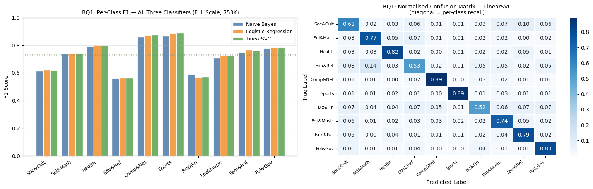
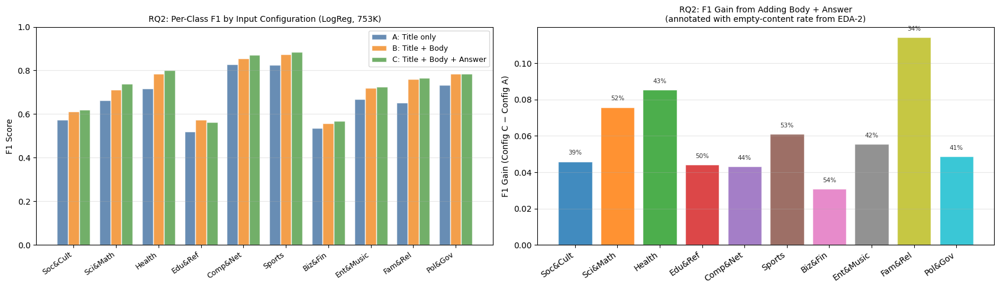
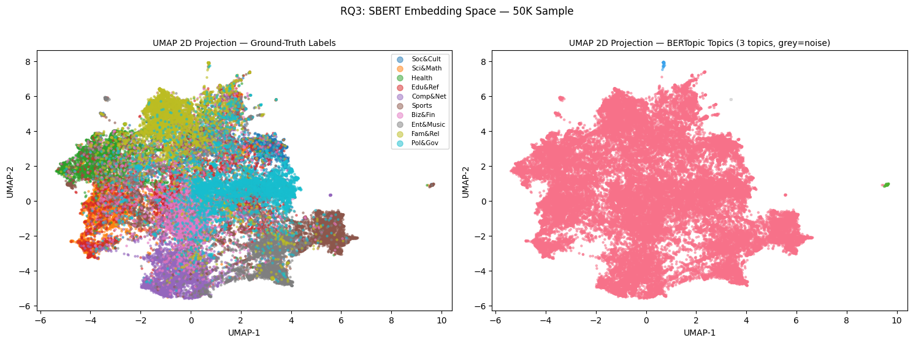
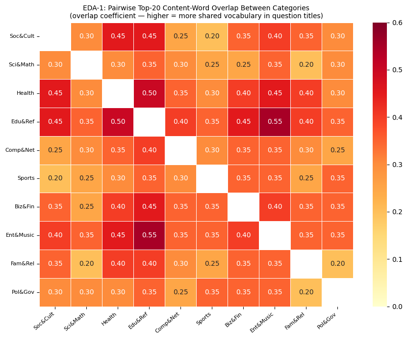
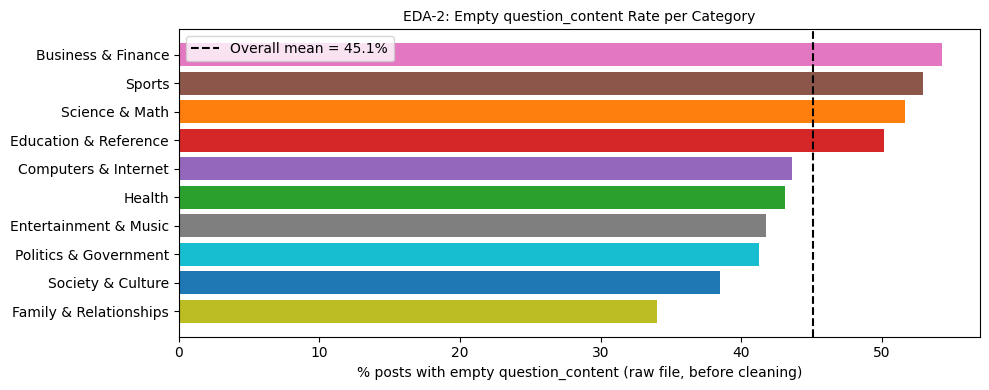
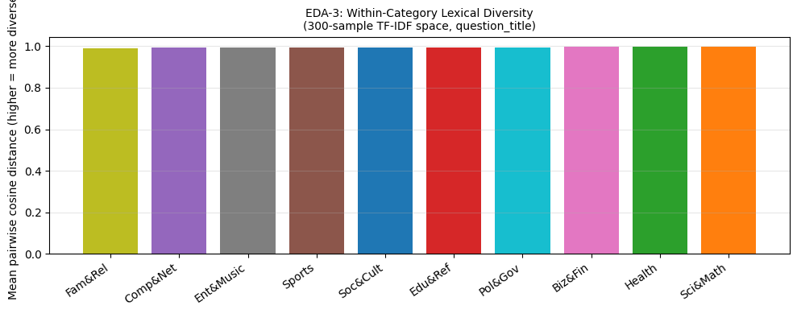

# Can a Machine Learn What You're Really Asking?
## Yahoo Answers Topic Classification: Scale, Failure Modes, and the Value of More Text

**Course:** Data Mining  
**Dataset:** Yahoo Answers Topic Classification Dataset — 753,677 training samples, 32,265 test samples, 10 topic categories

Yahoo Answers is noisy, informal, and chaotic — exactly the kind of text that challenges real-world NLP systems. This project builds a complete topic-classification pipeline using TF-IDF-based classifiers and BERTopic to answer one central question: **do the failure modes of a supervised classifier match the structural properties we can measure directly from the data — and do the human topic labels reflect natural clusters, or are they imposed on a continuous semantic space?**

---

## Start Here: [`main_notebook.ipynb`](./main_notebook.ipynb)

The main deliverable is `main_notebook.ipynb` — a curated, narrative-driven notebook that walks through all sections of the project, from EDA through full-scale experiments and conclusions.

---

## Project Video

[Watch the Project Walkthrough on YouTube](https://www.youtube.com/watch?v=iMLKTd4SYoY)

---

## Research Questions

This project is organized around three research questions, each derived directly from EDA findings:

| RQ | Question | Technique | Macro F1 |
|---|---|---|---|
| **RQ1** | How well do TF-IDF classifiers scale from 10K to 753K samples? Which category pairs drive the most confusion — and does confusion rank match vocabulary overlap rank? | TF-IDF + Naive Bayes, Logistic Regression, LinearSVC | **0.733** |
| **RQ2** | Does adding question body and best answer improve accuracy — and is the improvement equal across categories, or predicted by each category's missingness rate? | Input ablation (Config A/B/C) + McNemar's test | **0.733 → Config C** |
| **RQ3** | Does an unsupervised method recover the human topic labels from the raw text, or are Yahoo Answers categories human-imposed distinctions on a continuous semantic space? | BERTopic (SBERT + UMAP + HDBSCAN) | ARI = 0.000 |

---

## Dataset

**Name:** Yahoo Answers Topic Classification Dataset  
**Source:** https://www.kaggle.com/datasets/yacharki/yahoo-answers-10-categories-for-nlp-csv  
**Original paper:** Zhang et al., 2015 — Character-level Convolutional Networks for Text Classification

Each record contains four fields:

| Field | Description |
|---|---|
| `question_title` | Title of the question (always present) |
| `question_content` | Body of the question (empty in ~46% of posts) |
| `best_answer` | Community-selected best answer |
| `class_index` | One of 10 topic categories (1–10 in raw file, remapped to 0–9) |

**Size after cleaning** (rows with any empty text field dropped):
- Training set: 753,677 samples (down from 1,399,999 — 46.2% removed)
- Test set: 32,265 samples

The dataset files are too large to commit to this repo (~500 MB). Download `train.csv` and `test.csv` from the Kaggle link above and upload them directly to your Colab session. See [`data/README_data.md`](./data/README_data.md) for full instructions.

**Preprocessing steps:**
1. Parse with `quoting=csv.QUOTE_ALL` — handles embedded commas in answers
2. Remap labels 1–10 to 0–9 for scikit-learn compatibility
3. Drop rows where any text field is empty or whitespace-only
4. Build three derived text configurations for the RQ2 ablation: Config A (title only), Config B (title + body), Config C (title + body + answer)

---

## How to Reproduce

This project was built entirely in Google Colab.

1. Open `main_notebook.ipynb` in [Google Colab](https://colab.research.google.com/)
2. Download `train.csv` and `test.csv` from Kaggle and upload them to your Colab session via Files > Upload
3. Run all cells top to bottom — the first cell installs all required packages
4. For the BERTopic section (Section 8), a GPU runtime is recommended: Runtime > Change runtime type > T4 GPU

To install dependencies locally:
```bash
pip install -r requirements.txt
```

**Run order:**

| Step | File | Description |
|---|---|---|
| 1 | `checkpoints/checkpoint_1.ipynb` | Dataset selection and initial EDA |
| 2 | `checkpoints/checkpoint_2.ipynb` | Research question formalization and pilot experiments |
| 3 | `main_notebook.ipynb` | Full pipeline — EDA through conclusions |

---

## Scripts

The `scripts/` folder contains utilities for local setup, data access, and repo verification.

| Script | Description |
|---|---|
| [`scripts/setup.sh`](./scripts/setup.sh) | Creates a `.venv` virtual environment and installs all dependencies from `requirements.txt` |
| [`scripts/download_data.sh`](./scripts/download_data.sh) | Prints step-by-step instructions for downloading the dataset from Kaggle or Google Drive |
| [`scripts/extract_figures.py`](./scripts/extract_figures.py) | Extracts all image outputs from `main_notebook.ipynb` and saves them to `graphical_plots/` |
| [`scripts/verify_setup.py`](./scripts/verify_setup.py) | Checks that all expected repo files exist and all key packages are installed |

```bash
# Set up local Python environment
bash scripts/setup.sh

# Get dataset download instructions
bash scripts/download_data.sh

# Extract notebook figures to graphical_plots/
python scripts/extract_figures.py

# Verify repo structure and dependencies
python scripts/verify_setup.py
```

---

## Key Dependencies

| Package | Version | Used For |
|---|---|---|
| Python | 3.x (see requirements.txt) | Runtime |
| pandas | 2.x | Data loading and cleaning |
| numpy | 1.x / 2.x | Numerical operations |
| scikit-learn | 1.x | TF-IDF, classifiers, metrics |
| matplotlib | 3.x | All visualizations |
| seaborn | 0.13.x | Heatmaps and EDA plots |
| scipy | 1.x | McNemar's test (chi2) |
| bertopic | latest | RQ3 topic modeling |
| sentence-transformers | latest | SBERT embeddings (all-MiniLM-L6-v2) |
| umap-learn | latest | Dimensionality reduction |
| hdbscan | latest | Density-based clustering |

Full list of every package and version from the Colab session: [`requirements.txt`](./requirements.txt)

---

## Checkpoint Notebooks

| Notebook | Contents |
|---|---|
| [`checkpoints/checkpoint_1.ipynb`](./checkpoints/checkpoint_1.ipynb) | Three candidate datasets evaluated and compared (Yahoo Answers, Goodreads, MovieLens 20M); Yahoo Answers selected; initial EDA — token distributions, class balance, missingness audit |
| [`checkpoints/checkpoint_2.ipynb`](./checkpoints/checkpoint_2.ipynb) | Additional EDA run to discover interesting questions; research questions formalized from EDA findings; hypotheses stated; pilot classifier and sanity tests run |

---

## Results Summary

The central finding of this project is both practical and interpretive: **the Yahoo Answers topic boundaries are human-imposed distinctions on a continuous semantic space, not natural clusters that emerge from the text itself.** A supervised classifier can learn to mimic a labeling convention and reach 0.733 macro-F1; an unsupervised method finds essentially nothing to latch onto (ARI = 0.000).

### RQ1 — Classifier Performance at Scale

| Model | 10K Probe | 100K | 753K (Full) |
|---|---|---|---|
| Naive Bayes | 0.621 | 0.647 | 0.658 |
| Logistic Regression | 0.687 | 0.714 | 0.728 |
| LinearSVC | 0.689 | 0.717 | **0.733** |

LinearSVC is the strongest model overall. Confusion is concentrated in Education & Reference vs Science & Math — exactly the highest-overlap pair identified in EDA-1. The TF-IDF representation reaches a ceiling well before 753K samples; the spread between classifiers collapses to under 0.008 macro-F1 at full scale.



### RQ2 — The Value of More Text

| Configuration | Macro-F1 |
|---|---|
| A: Title only | 0.6723 |
| B: Title + Body | 0.7234 |
| C: Title + Body + Answer | **0.7328** |

Adding body text produces the largest gain (+0.051 from A to B). The gain is not equal across categories — it is directly predicted by each category's missing-body rate from EDA-2. Family & Relationships gains most (+0.113, 34% empty); Business & Finance gains least (+0.032, 54% empty). McNemar's test between Config A and Config C: χ² = 561.43, p ≈ 4.1×10⁻¹²⁴.



### RQ3 — BERTopic Latent Structure

BERTopic discovered only 3 topics from a 50K stratified sample, with 99.5% of documents assigned to a single undifferentiated cluster. ARI = 0.0000, NMI = 0.0074 — indistinguishable from random. The UMAP projection shows the embedding space is one large continuous blob with no sharp density boundaries, which is why HDBSCAN cannot form meaningful clusters.



---

## EDA Figures

### EDA-1: Cross-Category Vocabulary Overlap

Nearly every category pair shares substantial top-20 content words, dominated by generic help-seeking tokens. The highest-overlap pairs — Education & Reference vs Entertainment & Music (0.55) and Health vs Education & Reference (0.50) — predicted the hardest confusion pairs in RQ1.



### EDA-2: Empty Content Rate per Category

The empty body rate varies from 34% (Family & Relationships) to 54% (Business & Finance), setting up the RQ2 prediction that categories with more missing body text would benefit less from adding Config B and C inputs.



### EDA-3: Within-Category Lexical Diversity

Mean pairwise cosine distance in TF-IDF space is uniformly near 1.0 across all categories, indicating that every category is highly internally diverse. No category forms a tight homogeneous cluster — consistent with the BERTopic collapse in RQ3.



---

## Repo Structure

```
yahoo-answers-topic-classification/
│
├── main_notebook.ipynb          # Main deliverable — start here
├── README.md
├── requirements.txt             # Full dependency list (exported from Colab)
├── .gitignore
│
├── checkpoints/
│   ├── checkpoint_1.ipynb       # CP1: Dataset selection and initial EDA
│   └── checkpoint_2.ipynb       # CP2: Research questions and pilot experiments
│
├── data/
│   └── README_data.md           # Instructions for downloading the dataset
│
├── graphical_plots/
│   ├── EDA-1.png                # Cross-category vocabulary overlap heatmap
│   ├── EDA-2.png                # Empty content rate per category
│   ├── EDA-3.png                # Within-class lexical diversity
│   ├── RQ-1.png                 # Classifier performance at scale
│   ├── RQ-2.png                 # F1 gain by input configuration
│   └── RQ-3.png                 # UMAP projection — BERTopic results
│
└── scripts/
    ├── setup.sh                 # Create virtual environment and install dependencies
    ├── download_data.sh         # Dataset download instructions
    ├── extract_figures.py       # Extract notebook image outputs to graphical_plots/
    └── verify_setup.py          # Validate repo structure and dependencies
```

---

## References

1. Zhang, X., Zhao, J., & LeCun, Y. (2015). Character-level convolutional networks for text classification. *NeurIPS 28*.
2. Grootendorst, M. (2022). BERTopic: Neural topic modeling with a class-based TF-IDF procedure. *arXiv:2203.05794*.
3. Reimers, N., & Gurevych, I. (2019). Sentence-BERT: Sentence embeddings using Siamese BERT-networks. *EMNLP 2019*. arXiv:1908.10084.
4. McInnes, L., Healy, J., & Melville, J. (2018). UMAP: Uniform Manifold Approximation and Projection. *JOSS*. arXiv:1802.03426.
